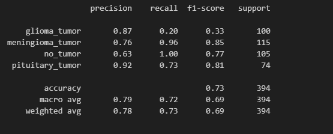

# DETEKMOR

Deteksi Tumor Otak menggunakan machine learning. Self project saya yang saya kerjakan untuk mengisi waktu luang.
Saya menggunakan model algoritma CNN untuk melatih model saya dan juga saya menggunakan dataset Brain tumor dari kaggle. Format gambar nya 300x300 1 chanel, untuk akurasi dari model ini masih belum sempurna masih di rentang 68-70%.

Report Klasifikasi:  
 

Untuk Requirements yang di butuhkan hanya cv2, tensorflow, keras, pandas, numpys, sckit-learn. tidak ada yang lain. 

Tantangan dalam mengembangkan model ini:  
$ Menyama ratakan masing masing kelas  
$ Meningkatkan akurasi untuk realtime klasifikasi  

Link Model : [Model](https://drive.google.com/drive/folders/1N4Ln9ewI9xgrZvtGygFTYZWdm3FZzNwo?hl=id)  

Link Dataset : [Dataset](https://www.kaggle.com/code/ayaehabramadan/mri-brain-tumor-classification)
